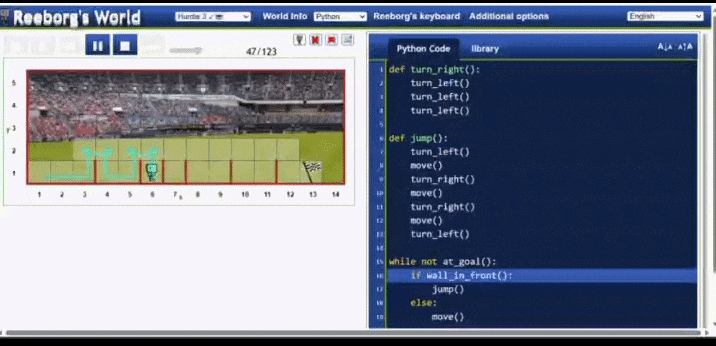

# 🏃 Reeborg's World - Hurdle 3

This project contains my solution to the Hurdle 3 challenge in Reeborg's World using Python.

## 📌 About the Challenge
The goal is to help the robot jump over hurdles and reach the finish line.

## 🧠 Solution Approach
- Use a loop to move until reaching the goal.
- Detect walls in front.
- Use a custom `jump()` function to pass obstacles.

## 💻 Code Structure
- `turn_right()` function
- `jump()` function
- `while not at_goal()` loop

## 🚀 Technologies Used
- Python

## 🎥 Demo

---
👩‍💻 Created by Fateme Heydari
